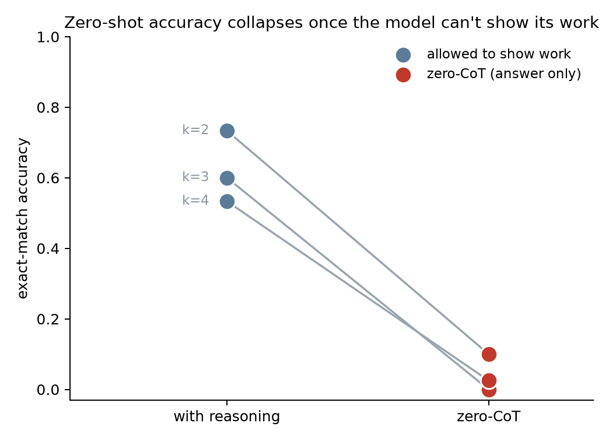
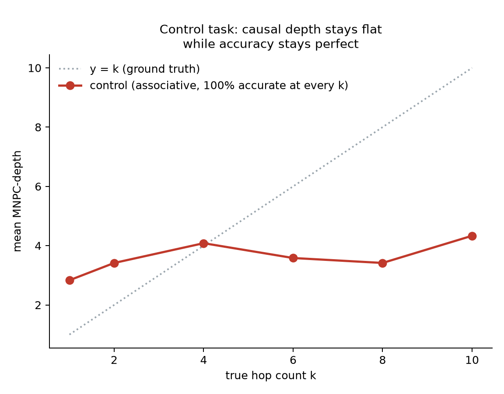
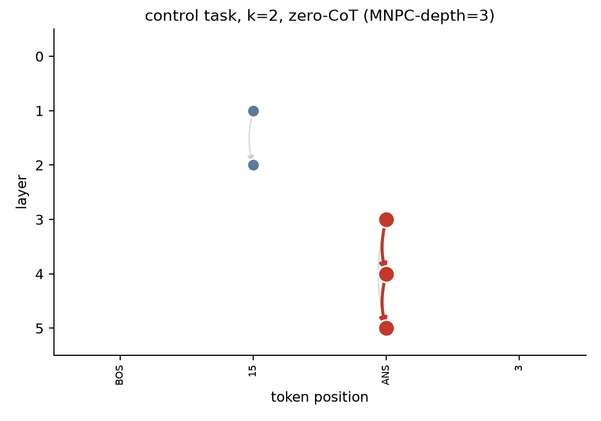
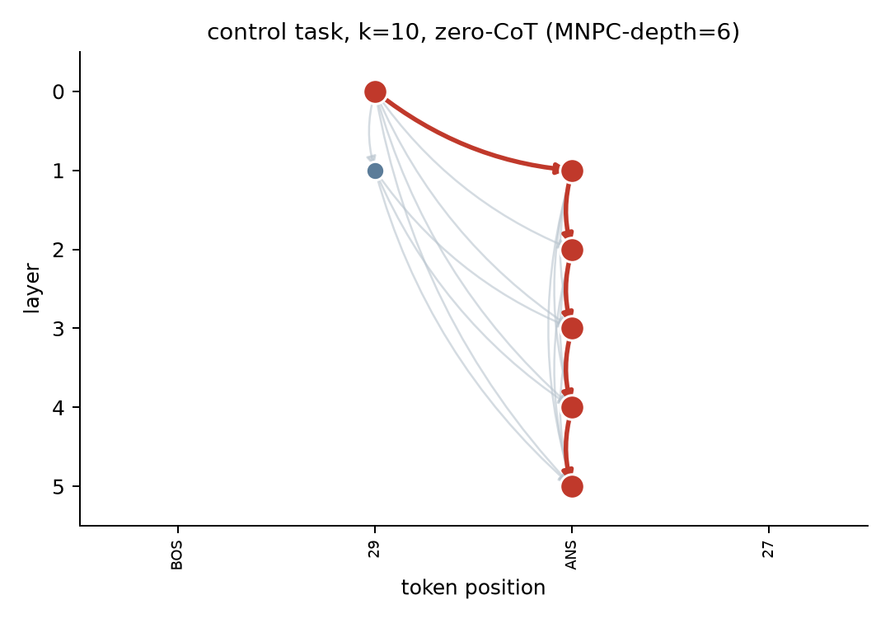
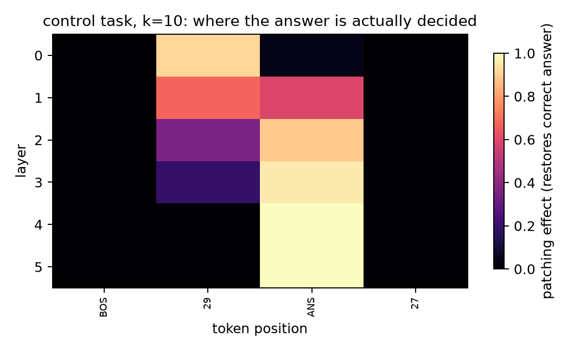
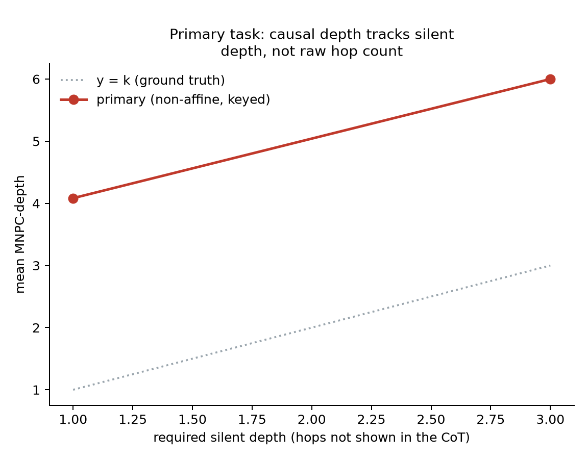
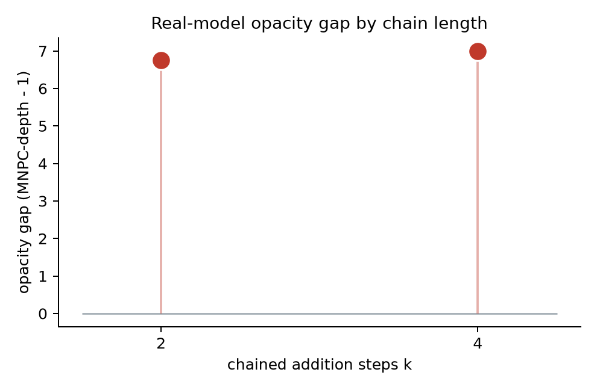

<h1 align="center">Undertow</h1>
<p align="center"><i>A causal, calibrated instrument for how much serial computation a transformer hides beneath its chain-of-thought.</i></p>

<p align="center">
  
</p>

<p align="center"><sub>Qwen2.5-0.5B-Instruct on the same chained-addition problems, with and without permission to show its work.</sub></p>

## Say one thing, compute another

A model's written chain-of-thought is the main thing anyone can currently audit about its reasoning. That only works as oversight if the CoT is a reasonably complete account of what the model actually computed. It might not be: a transformer's forward pass can silently do work no token ever reports.

This project builds a way to check, for a given model and task, how much serial computation is happening off the page. Not by asking the model to introspect, and not by training a bigger probe on its activations, but by causally intervening on the computation itself: corrupt an input, restore one internal site at a time, and see which sites are actually necessary for the right answer to come out. Chain those necessary sites into a dependency graph, and the length of the longest chain is a lower bound on how many sequential steps of hidden computation occurred.

That number needs to earn trust before it means anything. Most of this project is the earning.

## The instrument this project is not the first to build

| Piece | Where it comes from | What Undertow does with it |
|---|---|---|
| Resample-ablation activation patching | Wang et al., 2022 (the IOI circuit paper) | The base causal-effect measurement at every (layer, token) site |
| Automated circuit discovery from patching | Conmy et al., 2023 (ACDC) | Reused for *finding* necessary sites; **not** reused for what to do with them |
| Path patching between specific sites | Goldowsky-Dill et al., 2023 | The pairwise mediation test that turns a flat set of sites into a directed graph |
| Faithfulness as the bar a circuit must clear | Redwood Research's causal-scrubbing line of work | The gate that gets checked before any depth number is reported |
| Fixed-depth transformers need CoT for unbounded serial composition | Merrill & Sabharwal's work on transformer expressivity with and without chain-of-thought | The theoretical reason to expect a depth ceiling at all, and the reason the control task below was built the way it was |

None of that is new. What's new is narrower: turning a patching-derived graph's **depth**, not its size, into the object of interest; a calibration protocol that checks, on synthetic tasks with a known right answer, whether that depth number tracks genuine hidden computation or just counts residual-stream pass-through; and a paired task design that demonstrates a real associative-shortcut failure mode directly, as causal evidence, rather than leaving it as an assumption.

## The associative trap a depth measurement has to avoid

Iterating a single fixed function k times looks like an obvious way to build a task with a known serial depth of k. It is a trap: composing the *same* fixed function is associative, so a model that sees that function throughout training can memorize `S`, `S∘S`, `S∘S∘S∘S`, ... as a fixed, small set of shortcuts, and answer any number of iterations in a bounded number of steps without ever doing k real sequential steps. That is not a hypothetical: this project's own control task below demonstrates exactly that shortcut, on purpose, at 100% accuracy, out to ten iterations.

The fix is to close off the shortcut at the level of the data, not the architecture: give the model a *different*, input-supplied perturbation at every step, so there is no fixed composed function to memorize across training examples.

| | **Control task** (kept as the shortcut-prone case) | **Primary task** (built to resist the shortcut) |
|---|---|---|
| Recurrence | `s_i = π(s_{i-1})`, one fixed permutation `π` | `s_i = S((s_{i-1} + k_i) mod 32)`, one fixed bijection `S`, fresh random key `k_i` every step |
| What's fixed across the whole dataset | `π` itself | only `S` |
| What's supplied per example | just `s_0` and a hop count | `s_0` **and** every key `k_1 .. k_T` |
| Expected outcome | solvable at any depth via a memorized shortcut | genuinely each-step-dependent; no fixed function to memorize |

Everything downstream is run on both tasks side by side, specifically so the control task's success can be checked against what the causal trace says is actually happening, not just assumed away.

## Teaching the ruler to doubt itself

The method has two knobs: a threshold `tau` (how large a patching effect counts as "necessary") and a cap `top_k` (how many sites to keep before checking pairs for mediation). Both are chosen the same way for every result below:

1. Grid-search `tau` and `top_k` on a **calibration split** of held-out random seeds, picking whichever combination maximizes the Spearman correlation between measured depth and the known ground-truth quantity, counted only among combinations whose extracted subgraph clears a **0.5 minimum faithfulness bar** (does patching that whole subgraph at once actually reproduce the answer?).
2. Freeze `tau` and `top_k`. Re-run on a **disjoint held-out split** (different random seeds, never touched during the search) and report *that* number, not the calibration one.

A held-out correlation that collapses relative to calibration would be a hard stop, not something to fix by re-tuning against the held-out data. It didn't collapse for either task family below.

| Family | tau | top_k | calibration ρ | held-out ρ | held-out faithfulness |
|---|---|---|---|---|---|
| Control (depth vs. true k) | 0.7 | 6 | 0.262 | 0.286 | 100% |
| Primary (depth vs. required silent depth) | 0.7 | 6 | 0.671 | 0.673 | 100% |

Read those two rows together: a **low** correlation for the control task is the point, since the causal depth barely moves with k, because k isn't what's driving the computation there. A **high, stable** correlation for the primary task is what makes the depth number trustworthy where it's actually being used to measure something.

## What the tiny models actually did

<p align="center"></p>

Six six-layer transformers were trained on the control task at k = 1, 2, 4, 6, 8, 10, zero chain-of-thought. Every one of them reaches 100% accuracy. The dotted line is what genuine k-step serial computation would need; the solid line is what patching actually finds. At k=10 the model is claiming ten sequential hops and using roughly four necessary causal steps to do it: direct, causal evidence of the shortcut in the section above, not an inference from the accuracy number alone.

<p align="center">
  
  
</p>
<p align="center"><sub>Discovered circuit, k=2 vs. k=10, same model family. The chain barely gets longer.</sub></p>

<p align="center"></p>
<p align="center"><sub>Same k=10 example, every (layer, position) effect size at once. Almost all of it is dead outside two columns.</sub></p>

The primary task shows a sharp capability wall rather than a gradual slope: t_hops=1 is perfectly learnable zero-CoT (100%), and t_hops=2 sits at chance. To confirm the wall is real rather than an artifact of one particular configuration, the same t_hops=2 zero-CoT condition was tested across a spread of architectural and optimization settings:

| What was changed | Result at t_hops=2, zero-CoT |
|---|---|
| Nothing (baseline: 6 layers, d=48, 4000 steps) | 4.1% (chance = 3.1%) |
| 5x the training steps (20,000) | 3.7% |
| Smaller state space (32 states → 8) | 14.6% (chance = 12.5%, still chance-relative) |
| 2.7x the width (d=128) | 2.5% |
| 3x the learning rate | 4.1% |
| 2x the depth (12 layers) | 4.5% |
| 2.7x the depth (16 layers) | 3.7% |

Nothing moves it. Not more steps, not more width, not more depth, not a smaller alphabet, not a faster learning rate. Composing two steps of an input-keyed, non-affine substitution, with no chain-of-thought, is a wall this architecture family does not cross by gradient descent, at any size tried here: a much harder ceiling than "gets gradually harder with k."

Give it *anywhere* to write even one intermediate step, though, and the wall moves:

<p align="center"></p>

| Cell | Accuracy | What's silent |
|---|---|---|
| t_hops=2, full CoT | 100% | 1 step (the last one) |
| t_hops=2, partial CoT | 100% | 1 step |
| t_hops=6, partial CoT | 100% | 3 steps |
| t_hops=6, full CoT | did not converge in budget | 1 step, but 6 total positions to fit in the same training budget |
| t_hops=10, full/partial CoT | did not converge in budget | 1 / 5 steps |

Every cell that *did* converge shows causal depth tracking **required silent depth** (how many steps aren't shown), not raw t_hops: the "1 unshown step" cells cluster around depth ≈4, and the "3 unshown steps" cell sits at depth 6, which is exactly the relationship the calibration section above is reporting a ρ=0.67 for. The cells that didn't converge are reported as a training-budget limitation, not silently dropped: more supervised positions per sequence needed more than a fixed 4000-step budget provided, and there was nothing gained by throwing unlimited extra steps at a point already made.

## One real model, interrogated the same way

Qwen2.5-0.5B-Instruct, unmodified, on chained-addition word problems: plain addition rather than modular arithmetic, so the only difficulty in the task is the multi-step composition this project measures, not a second, unrelated difficulty from the modular reduction itself.

<p align="center"></p>

| k | Zero-shot accuracy (n=40) | Accuracy allowed to show work (n=15) |
|---|---|---|
| 2 | 10.0% | 73.3% |
| 3 | 0.0% | 60.0% |
| 4 | 2.5% | 53.3% |

The model can clearly do this arithmetic (53 to 73% correct given room to write it out) and just as clearly cannot do it silently. Patching only runs on answers the model actually got right, which zero-shot is rare by construction: 4 examples at k=2, 1 at k=4, and **zero at k=3**, reported as zero, not papered over with a smaller claim. On the handful that succeeded, measured causal depth was 3, 8, 10, and 10 (k=2) and 8 (k=4), well beyond the single step a shallow lookup would need, consistent with real hidden multi-step computation on the rare occasions this 0.5B model pulls it off silently, though four and one examples respectively is a case study, not a distribution.

## Scope, stated plainly

- The primary-task depth calibration has exactly two distinct x-values (1 and 3). A ρ=0.67 on two points is a real, held-out-stable, honestly-computed correlation; it is not a smooth curve, because a smooth curve was not available to compute it on.
- 100% faithfulness on every synthetic condition is a real, unmodified output of `subgraph_faithfulness`, and also almost certainly a feature of how small and clean these models and tasks are, not a property this method is shown to have at any other scale.
- The real-model result is a feasibility demonstration on one 0.5B model on one arithmetic task, not a claim about frontier models. The theoretical motivation is that opacity risk should grow with scale; this project did not test that directly.
- "MNPC-depth" is a lower bound constructed from a specific patching/mediation/thresholding pipeline, not a claim about the true minimum circuit depth in any absolute sense.

## Where everything lives

```
src/undertow/
  tasks.py       primary + control task generators, exact ground truth, hop-level resampling
  model.py       the tiny transformer (explicit per-layer loop, patchable by construction) + training
  patch.py       effect sizes, mediation edges, subgraph faithfulness
  graph.py       necessity thresholding + longest-path (MNPC-depth) extraction
  realmodel.py   the same cache/patch contract, via forward hooks, for Qwen2.5-0.5B-Instruct
  viz.py         every figure in this README, rendered from saved results only
scripts/
  run_grid.py            trains and checkpoints every synthetic cell this README cites
  calibrate.py           the tau/top_k search + held-out re-verification
  real_model_sweep.py    the Qwen phase, checkpointed and resumable
  summarize_real_model.py, make_figures.py, make_explorer_data.py
tests/           20 tests: exact ground-truth checks, a hand-built DAG with a known
                 longest path, and a from-scratch model check that patching the last
                 layer exactly reproduces the clean logits
explorer/index.html   see below
```

## Poke the circuit yourself

`explorer/index.html` is a single, self-contained file: every discovered circuit in this README, plus a few more, precomputed and embedded as data. No server, no build step, no network calls. Open it directly in a browser and switch between the control and primary examples to see the necessary-site graph and the highlighted longest chain for each one.

## How to run this end to end

```
uv venv .venv && uv pip install -e ".[dev]"
pytest tests/ -q                     # 20 passed

python scripts/run_grid.py           # trains + checkpoints all 11 synthetic cells
python scripts/calibrate.py          # tau/top_k search, held-out re-verification
python scripts/real_model_sweep.py   # Qwen2.5-0.5B-Instruct phase (downloads the model)
python scripts/summarize_real_model.py
python scripts/make_figures.py       # every PNG in assets/
python scripts/make_explorer_data.py # embeds data into explorer/index.html
```

Every number in this README comes from a file under `results/`, not from a script's console output copied by hand.

## Terms

Apache-2.0. See `LICENSE`.
